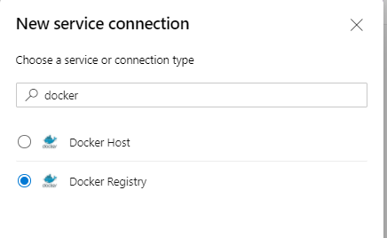
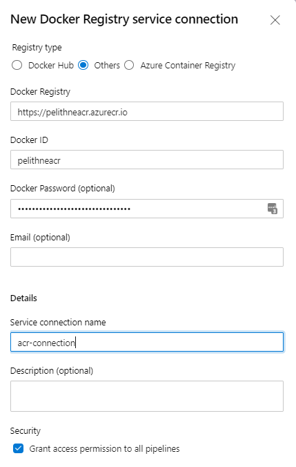
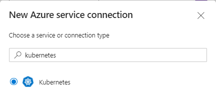
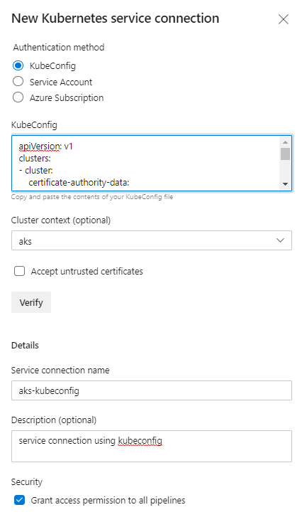

# Create pipeline from existing file

If your subscription does not allow creation of Service Principal, you will not be able to "automatically" generate a pipeline as is described in steps 3.6.4 and 3.6.5. Instead you will start from an existing pipeline definition from the repository. This pipeline has most of the configurations you need, but you are required to do some changes. 

First, you need to create a **Service Connection** for your container registry, to use in your pipelines.

Then, to access your AKS cluster from your pipeline, you need to create another service connection.

## Create Service Connections

As mentioned above, you need to create one service connection for ACR, and one for AKS.

### Service Connection for ACR

Start by navigating to *Project Settings* at the bottom of the left-hand navigation bar.

From the Project Settings screen, click on *Service connections* in the left-hand navigation bar (in the **Pipelines** section).

Now select **New Service Connection** in the top right corner. 

In the search field write "docker"

<p align="left">
  
</p>

Select "Docker Registry" and click **Next**

In the following screen, first select Registry type - Others (do not select Azure Container Registry).

Then use the credentials from you Azure Container Registry (Access Keys), like this:

<p align="left">
  
</p>

* Docker Registry - Your "Login Server" prepended by https://
* Docker ID - Your "Username"
* Docker Password - One of the generated passwords

Then click **Save** at the bottom of the screen.

### Service Connection for AKS
Create another "New Service Connection". In the search field, type "Kubernetes" and select kubernetes from the search results, then click **Next**.

<p align="left">
  
</p>

In the next screen select **KubeConfig** as Authentication method.

Next, you need to paste your kubeconfig into the KubeConfig-field. To get your kubeconfig, you can run the following command in your cloud shell:

````bash
az aks get-credentials --resource-group <RG name> --name <Cluster name> --file kubeconfig.txt
````

Then copy all the contents of the file kubeconfig.txt and paste that into the Kubeconfig field in Azure Devops.

For example you can use **code** to view the file and copy the content.

````bash
code kubeconfig.txt
````

Finally give a name (like "aks-kubeconfig") to the service connection. You should end up with something looking similar to this:

aks-service-connection-kubeconfig.PNG
<p align="left">
  
</p>

Finally, click **Verify and Save** to create your Kubernetes service connection.


## Use Service Connections in pipeline

As mentioned previously, you will use an already existing ````azure-pipelines.yaml```` and modify to match your setup.

Select to **create a new pipeline**, and then choose **Existing Azure Pipelines YAML file**

You can reference the Service Connection from your pipeline, simply using their names. For instance, you can create a variable called $aks_sc that references your Kubernetes Service Connection by including this in your yaml pipeline

````yaml
aks_sc: "aks-kubeconfig"
````

Then you can use that variable later in the pipeline by referencing the variable. Like so:

````yaml
kubernetesServiceConnection: $(aks_sc)
````

In order to use the service connections you created, you need to put them into the file azure-pipelines.yaml, which was created automatically for you in a previous step, and which you have already modified a bit.

You should have an azure-pipelines.yaml that looks something like this:

````yaml
# Deploy to Azure Kubernetes Service
# Build and push image to Azure Container Registry; Deploy to Azure Kubernetes Services
# https://docs.microsoft.com/azure/devops/pipelines/languages/docker

trigger:
- master

resources:
- repo: self

variables:

  # Container registry service connection established during pipeline creation
  dockerRegistryServiceConnection: "<Your ACR Service Connection name>"
  kubernetesServiceConnection: "<Your AKS Service Connection name>"
  imageRepository: 'azure-vote-front'
  dockerfilePath: '**/application/azure-vote-app/Dockerfile'
  tag: '$(Build.BuildId)'
  imagePullSecret: 'acr-secret'

  # Agent VM image name
  vmImageName: 'ubuntu-latest'
  

stages:
- stage: Build
  displayName: Build stage
  jobs:  
  - job: Build
    displayName: Build
    pool:
      vmImage: $(vmImageName)
    steps:
    - task: Docker@2
      displayName: Build and push an image to container registry
      inputs:
        command: buildAndPush
        repository: $(imageRepository)
        dockerfile: $(dockerfilePath)
        containerRegistry: $(dockerRegistryServiceConnection)
        tags: |
          $(tag)
          
    - upload: application/azure-vote-app
      artifact: application/azure-vote-app/

- stage: Deploy
  displayName: Deploy stage
  dependsOn: Build

  jobs:
  - deployment: Deploy
    displayName: Deploy
    pool:
      vmImage: $(vmImageName)
    environment: 'k8s'
    strategy:
      runOnce:
        deploy:
          steps:
          - task: KubernetesManifest@0
            displayName: Create imagePullSecret
            inputs:
              action: createSecret
              secretName: $(imagePullSecret)
              dockerRegistryEndpoint: $(dockerRegistryServiceConnection)
              kubernetesServiceConnection: $(kubernetesServiceConnection)
              
          - task: KubernetesManifest@0
            displayName: Deploy to Kubernetes cluster
            inputs:
              action: deploy
              manifests: |
                $(Pipeline.Workspace)/application/azure-vote-app/azure-vote-all-in-one-redis.yaml
              imagePullSecrets: |
                $(imagePullSecret)
              containers: |
                $(containerRegistry)/$(imageRepository):$(tag)
              kubernetesServiceConnection: $(kubernetesServiceConnection)

````

In this file you need to replace the dockerServiceConnection, and your kubernetesServiceConnection.

First, change this:
````yaml
  dockerRegistryServiceConnection: ' '
````

to
````yaml
dockerRegistryServiceConnection: 'the name of your ACR Service Connection'
````

Then change 

````yaml
kubernetesServiceConnection: ' '
````

to
````yaml
kubernetesServiceConnection: 'the name of your AKS Service Connection'
````

## Continue back to main workshop

Now that you have created a pipeline, you can continue back to the main workshop.

You should be able to continue at the step "Run Pipeline". 
