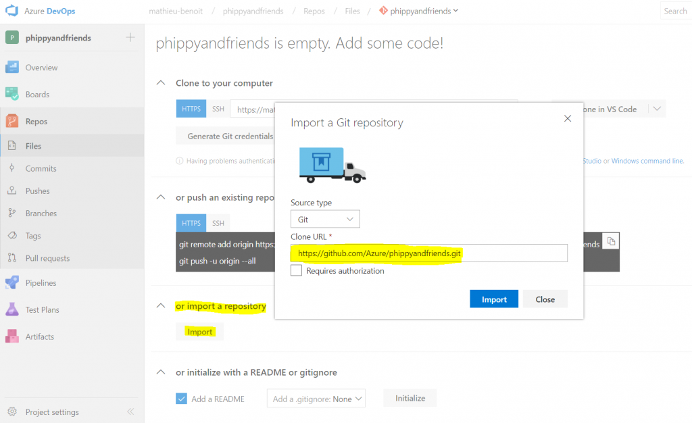
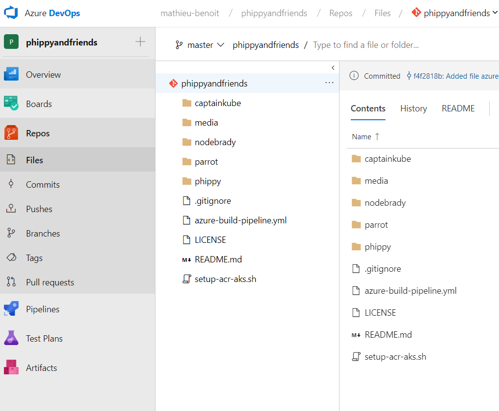

## Introduction

### Note: This is an adapted version of a tutorial found here: https://cloudblogs.microsoft.com/opensource/2018/11/27/tutorial-azure-devops-setup-cicd-pipeline-kubernetes-docker-helm/

The difference from the original is that we will reuse some of the resuources used in the "main kubernetes workshop" from this repository.

In this tutorial, we will setup a CI/CD pipeline to deploy your apps on a Kubernetes cluster with Azure DevOps by leveraging a Linux agent, Docker and Helm. The combination of these technologies will illustrate how you can easily setup a CI/CD pipeline, leverage Configuration-as-Code and Infrastructure-as-Code, and accelerate your DevOps journey with containers.

Here are the technologies we’ll walk through:

**Azure DevOps** helps to implement your CI/CD pipelines for any platform, any languages.

**Docker** adds more consistency and quality for your apps, their deployment and management. Docker allows also to be programming languages agnostic, all your apps packaged as Docker images could be in different languages: .NET Core, Java, Node.js, Go, Python, etc.

**Helm** simplifies and automates more your apps deployments in Kubernetes.

**Kubernetes** is a container orchestrator that makes the collaboration between developers and IT pros easy and will for sure help you in the orchestration, management, and monitoring of all your apps containerized, in a consistent way.

**Azure Kubernetes Service (AKS)** is a fully managed Kubernetes container orchestration service, simplifying the process around creating, scaling and upgrading your Kubernetes cluster. You are not paying for the master nodes, since that’s part of the managed offer.

**Azure Container Registry (ACR)** is a dedicated enterprise container registry with advanced features like Helm chart repository, geo-replication of your registry across the globe, container build capabilities, security scanning for your images, etc.

## Prerequisites & Setup
* Completed "main workshop" from this repository


## Install Helm
````
$ kubectl create serviceaccount tiller --namespace kube-system
$ kubectl create clusterrolebinding tiller --clusterrole cluster-admin --serviceaccount=kube-system:tiller
$ kubectl create clusterrolebinding default-view --clusterrole=view --serviceaccount=<your namespace>:default
````

The DevOps Workflow with Containers
This is the DevOps workflow with containers illustrated in this tutorial:

 

* Devs and Ops commit code change (apps, infrastructure-as-code, etc.) to Azure repos
* Azure build pipeline will build and push both the app as a Docker image and the Helm chart in an Azure Container Registry (ACR)
* Azure release pipeline will deploy the specific Helm chart to an Azure Kubernetes Service (AKS) cluster


## Source control
We will use the existing Azure/phippyandfriends GitHub repo. This repo has a few services, each of them represents an individual character of the Children’s Guide to Kubernetes and their new friend NodeBrady. Each service is written in a different language, showing how an AKS cluster can run anything you can bring it. Parrot is in .NET Core, CaptainKube is in Go, Phippy in PHP and NodeBrady in Node.js.

First, you will need to import this repo https://github.com/Azure/phippyandfriends into your own Azure repos (from the Azure DevOps project you just created earlier):

 

Once imported you will be able to browse the source code of the four different apps: CaptainKube, NodeBrady, Parrot and Phippy:

 

Each app has its own folder and the same structure within it:

 

Files of the app itself, depending of the programming languages: Parrot is in .NET Core, CaptainKube is in Go, Phippy in PHP and NodeBrady in Node.js.
Dockerfile file is a script leveraged by Docker, composed of various commands (instructions) and arguments listed successively to automatically perform actions on a base image in order to create a new Docker image by packaging the app.
charts/* folder contains the files defining Helm Chart of the app. Helm Charts helps you define, install and upgrade your app in Kubernetes.
With the next section we will also leverage the azure-build-pipeline.yml which plays an important role as Configuration-as-Code for the Azure build pipeline definition.

Related resources:

Branch policies with Azure Repos
Pull requests with Azure Repos
Create a Build pipeline
We will now create an Azure build pipeline for the Parrot app to be able to both build/push its Docker image and package/push its Helm chart. For that we will need to create a build pipeline definition using the azure-build-pipeline.yml file. From the menu Pipelines > Builds, follow the steps illustrated below:

Then, you need to add some Variables for this build pipeline definition by providing your own values:

projectName
Since we are setting this up for the Parrot project, just put: Parrot
registryLogin
You could get it by running this command from Azure Cloud Shell: az acr credential show -n acr-name --query username
registryName
You could get it by running this command from Azure Cloud Shell: az acr show -n acr-name --query name
registryPassword
You could get it by running this command from Azure Cloud Shell: az acr credential show -n acr-name --query passwords[0].value


You could now Save & Queue a new build which will push both the Docker image and the Helm chart in your ACR.


From there you can run some Azure CLI commands from Azure Cloud Shell to check what you pushed in ACR:

# List Docker images from your ACR
$ az acr repository list -n acr-name
# List Helm charts from your ACR
$ az acr helm list -n acr-name
# Show details of a specific Helm chart from your ACR
$ az acr helm show chart-name -n acr-name
Now both the Docker image and the Helm chart could be used for any Kubernetes cluster from anywhere: locally, etc. You will see in the next section how to use them with a release pipeline.

Related resources:

Build agents with Azure Pipelines
Azure build pipeline triggers
Geo-replication in Azure Container Registry
Content trust in Azure Container Registry
Azure Container Registry webhooks
Create a Release pipeline
We will now create an Azure release pipeline for the Parrot app to be able to deploy it via its associated Helm chart. From the menu Pipelines > Releases, follow the steps illustrated below:

You can now reorder the tasks, select each task, and update the different fields with this info below:

Helm tool installer – Install Helm 2.11.0
Helm Version Spec: 2.11.0
Check for latest version of Helm: false
Package and deploy Helm charts – helm init
Connection Type: Kubernetres Service Connection or Azure Resource Manager
Command: init
Upgrade Tiller: true
Wait: true
Arguments: --service-account tiller
Bash: az acr helm repo add
Type: Inline
Script: az acr helm repo add -n $(registryName) -u $(registryLogin) -p $(registryPassword)
Package and deploy Helm charts – helm upgrade
Connection Type: Kubernetres Service Connection or Azure Resource Manager
Command: upgrade
Chart Type: Name
Chart Name: $(registryName)/$(projectName)
Release Name: $(projectName)
Namespace: phippyandfriends
Install if release not present: true
Wait: true
Arguments: --version $(build.buildId) --set image.repository=$(registryName).azurecr.io/$(projectName) --set image.tag=$(build.buildId) --set image.private=true --set image.username=$(registryLogin) --set image.password=$(registryPassword) --set ingress.enabled=false


Then, you need to add some Variables for this release pipeline definition by providing your own values:

projectName
Since we are setting this up for the Parrot project, just put: Parrot
registryLogin
You could get it by running this command from Azure Cloud Shell: az acr credential show -n acr-name --query username
registryName
You could get it by running this command from Azure Cloud Shell: az acr show -n acr-name --query name
registryPassword
You could get it by running this command from Azure Cloud Shell: az acr credential show -n acr-name --query passwords[0].value


You can now Save and Release > Create a Release to run this release pipeline, which will deploy the Parrot’s Helm chart.


Once deployed successfully, you can now run this command from your Azure Cloud Shell to get the EXTERNAL-IP value of the service/parrot-parrot:

$ kubectl get all -n phippyandfriends


Then, open a web browser to navigate to this URL:

Congratulations! You have deployed the Parrot app on your Kubernetes cluster via a Helm Chart. With the next section you will see how to deploy the other apps/friends.

Related resources:

What’s Azure Pipelines release service?
Release stages, queuing policies, and options
Release approvals and gates
Where are Phippy and the other friends?
You are right, we just have the Parrot app so far! You could now Clone both Parrot’s Build and Release pipelines definitions you created and adapt them with CaptainKube, Phippy and NodeBrody. Don’t forget these Build and Release pipelines definitions are generic, you just have to change the projectName variable in the Variables section.

You should now have four build definitions and four release definitions that you can now run to eventually see the Parrot app showing its friends:


Conclusion
Congratulations! You have deployed 4 different apps in a Kubernetes cluster by leveraging Azure DevOps, Azure Container Registry, Azure Kubernetes Service, Docker and Helm! You have also used Azure Cloud Shell to run some Azure and Kubernetes commands.


As illustrated throughout this blog post, all together the technologies used will help you create a generic, strong and robust DevOps pipeline to deploy your apps from any languages to any platform. There are three central pieces simplifying the collaboration between the developers and the IT Pros – it’s about Configuration-as-Code and Infrastructure-as-Code:

Dockerfile as the description of the packaging of your app
Helm chart as the description of the deployment of your app on Kubernetes
YAML Build pipeline as the description of the build process in Azure DevOps
Note: Release pipeline as YAML file is coming soon.
Hope you enjoyed this blog article and hopefully you will be able to leverage this for your own apps and needs. Questions or feedback? Let us know in the comments below. Cheers!
