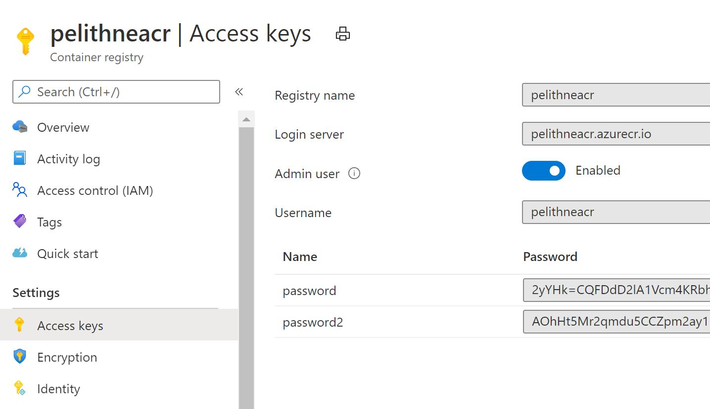

# Connect to ACR without service principal

## Enable Admin Account

If your subscription does not allow you to create Service Principals, You can allow access to your container registry using the "Admin Account". Note however that this is only recommended for testing scenarios.

After creating your container registry, go to the portal and navigate to the resource. Then click Access Keys in the left hand navigation bar, and enable the toggle for "Admin User", like in the image below:

<p align="left">
  
</p>

Note that you can see your login server name, the user name and two secrets, either of which you can use (and will use below).


## Create and use secret for image pull

You need to give your AKS kluster access to pull images from your container registry. One way of doing that is to use a service principal, but if that is not possible you can create an image pull secret.

This secret needs to be included in the kubernetes manifest you use to create your deployment.

## Create secret

From your cloud shell (or any shell that is connected to your kubernetes cluster) perform the steps below to create a secret named ````acr-secret````

````bash
ACR=<your unique ACR name>.azurecr.io

USERNAME=$(az acr credential show -n $ACR --query="username" -o tsv)
PASSWORD=$(az acr credential show -n $ACR --query="passwords[0].value" -o tsv)

kubectl create secret docker-registry acr-secret \
  --docker-server=$ACR \
  --docker-username=$USERNAME \
  --docker-password=$PASSWORD \
  --docker-email=anything@mail.com
  ````
  
  You should get a positive acknowledgement that the secret was created. 

  ## Use secret in deployment

  To use the secret when deploying to AKS, you need to edit ````azure-vote-all-in-one-redis.yaml```` a bit more. 

  You need to add the following, at the very end of the Deployment section for azure-vote-front. 

````yaml
  imagePullSecrets:
  - name: acr-secret 
````

Note that ````imagePullSecrets```` should be on the same level as ````containers```` and ````nodeSelector````

You should end up with a file similar to this:

````yaml
apiVersion: apps/v1
kind: Deployment
metadata:
  name: azure-vote-back
spec:
  replicas: 1
  selector:
    matchLabels:
      app: azure-vote-back
  template:
    metadata:
      labels:
        app: azure-vote-back
    spec:
      nodeSelector:
        "beta.kubernetes.io/os": linux
      containers:
      - name: azure-vote-back
        image: redis
        ports:
        - containerPort: 6379
          name: redis
---
apiVersion: v1
kind: Service
metadata:
  name: azure-vote-back
spec:
  ports:
  - port: 6379
  selector:
    app: azure-vote-back
---
apiVersion: apps/v1
kind: Deployment
metadata:
  name: azure-vote-front
spec:
  replicas: 1
  selector:
    matchLabels:
      app: azure-vote-front 
  strategy:
    rollingUpdate:
      maxSurge: 1
      maxUnavailable: 1
  minReadySeconds: 5 
  template:
    metadata:
      labels:
        app: azure-vote-front
    spec:
      nodeSelector:
        "beta.kubernetes.io/os": linux
      containers:
      - name: azure-vote-front
        image: <your unique ACR name>.azurecr.io/azure-vote-front:v1
        ports:
        - containerPort: 80
        resources:
          requests:
            cpu: 250m
          limits:
            cpu: 500m
        env:
        - name: REDIS
          value: "azure-vote-back"
      imagePullSecrets:
      - name: acr-secret
---
apiVersion: v1
kind: Service
metadata:
  name: azure-vote-front
spec:
  type: LoadBalancer
  ports:
  - port: 80
  selector:
    app: azure-vote-front

````

