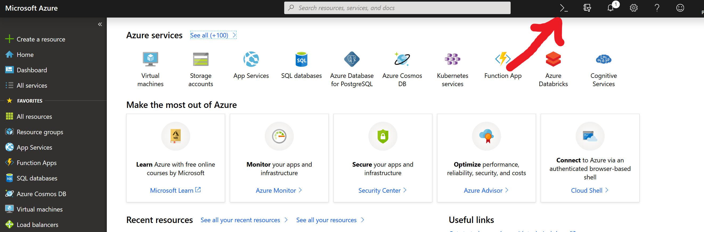

# Azure Kubernetes Service (AKS) Workshop

This workshop/tutorial contains a number of different sections, each addressing a specific aspect of running docker containers locally and in the cloud. You will do things like:

 * Clone a github repository
 * Create docker container images
 * Run an application on your local machineyour
 * Upload images to a container registry
 * Deploy an application in Kubernetes
 * Scale/modify/update an application in Kubernetes
 * Deploy an application using Helm
 * Modify an application using Helm
 * and much more... 
 
 The basic idea with the workshop, is to deploy the same application over and over (and over) again, but using more and more "advanced" methods.
 

## Running Docker Containers locally

In this first step in the tutorial, you will prepare a multi-container application for use in your local docker environment. Existing tools such as Git and Docker are used to locally build and test an application. You will learn how to:

 * Clone a sample application source from GitHub
 * Create a container image from the sample application source
 * Test the multi-container application in a local Docker environment

Once completed, the following application runs in your local development environment:

 


### Get application code

The sample application used in this tutorial is a basic voting app. The application consists of a front-end web component and a back-end Redis instance. The web component is packaged into a custom container image. The Redis instance uses an unmodified image from Docker Hub.

Use```git``` to clone the sample application to your development environment (if you already cloned the repo during preparations, you can skip this obviously):

```console
git clone https://github.com/pelithne/azure-vote-app.git
```

Change directories so that you are working from the cloned directory.

```console
cd azure-vote-app
```

Inside the directory is the application source code, a pre-created Docker compose file, and a Kubernetes manifest file. These files are used throughout the tutorial.

### Create a docker network

#### Note: if you are using WSL, and if you have not installed docker there, you need to use `docker.exe` on the command line. 

This network will be used by the containers that are started below, to allow them to communicate with each other

```console
 docker network create mynet
```

### Create container images

Build azure-vote-front, using the Dockerfile located in ./azure-vote. This will create two images, one base image and one for the azure-vote-front.

#### Note: If you are behind a proxy, you can add an HTTPS proxy to the build command (--build-arg HTTPS_PROXY=http://xx.xx.xx.xx:xx)
```console
 docker build -t azure-vote-front ./azure-vote
```
Please review ./azure-vote/Dockerfile to get an understanding for container images get created based on this file.

### Run the application locally
First start the redis cache container. The command below will start a container with name "azure-vote-back" using the official redis docker container. The app will use the network "mynet" created in the previous step. If this is the first time the command is executed, the image will be downloaded to your computer (this can take a while). 

Note that in the command below, the container is instructed to use the network ```mynet``` that was created in a previous step.
```console
docker run -d --name azure-vote-back --net mynet redis
```

Now start the frontend container. The command below will start a container with name "azure-vote-front" using the previously built container. Additionally port 8080 will be exposed (so that the application can be accessed locally using a browser) and insert an environment variable ("REDIS") that will be used to connect to the redis cache.
```console
docker run --name azure-vote-front -d -p 8080:80 --net mynet -e "REDIS=azure-vote-back" azure-vote-front
```

When completed, use the ```docker images``` command to see the created images. Three images have been downloaded or created. The *azure-vote-front* image contains the front-end application and uses the `nginx-flask` image as a base. The `redis` image is used to start a Redis instance.

```
$ docker images

REPOSITORY                   TAG                   IMAGE ID            CREATED             SIZE
azure-vote-front             latest                00c4df2b3d4b        11 minutes ago      192MB
redis                        latest                5958914cc558        11 days ago         94.9MB
tiangolo/uwsgi-nginx-flask   python3.6-alpine3.8   6266b62f4b60        2 weeks ago         192MB
```

To see the running containers, run ```docker ps```:

```
$ docker ps

CONTAINER ID        IMAGE             COMMAND                  CREATED             STATUS              PORTS                           NAMES
82411933e8f9        azure-vote-front  "/usr/bin/supervisord"   57 seconds ago      Up 30 seconds       443/tcp, 0.0.0.0:8080->80/tcp   azure-vote-front
b68fed4b66b6        redis             "docker-entrypoint..."   57 seconds ago      Up 30 seconds       0.0.0.0:6379->6379/tcp          azure-vote-back
```

### Test application locally

To see the running application, enter http://localhost:8080 in a local web browser. If you are using Docker Toolbox, the default address will be http://192.168.99.100:8080.

The sample application loads, as shown in the following example:


### Clean up resources

Now that the application's functionality has been validated, the running containers can be stopped and removed. Do not delete the container images - in the next step, the *azure-vote-front* image will be uploaded to an Azure Container Registry.

Stop and remove the container instances:

```console
docker stop azure-vote-front azure-vote-back
docker rm azure-vote-front azure-vote-back
```

## Moving it all to the Cloud
Now you have tried running your dockerized application locally on your machine. In the next steps you will go through the steps needed to deploy it in **Azure Kubernetes Service**.

<!--
### Creating a Resource Group
All resources in azure live inside a **Resource Group**. For this workshop you will create one Resource Group (RG), to hold all the resources you create. You can create the RG with a one-liner, using the **Azure CLI.**
````
az group create --name <Your RG name> --location westeurope
````
-->

### Using the Azure Container Registry

This workshop assumes that a Container Registry is already created using ACR. If this is not the case for you, please follow these instructions to create one: https://docs.microsoft.com/en-us/azure/aks/tutorial-kubernetes-prepare-acr


<!--
You can create you own container registry in **Azure**, to store all your docker container images. For this workshop you will create an Azure Container Registry (ACR) to store your images, with this command:
````
az acr create --resource-group <Your RG name from above> --name <Your ACR Name> --sku Basic
````
-->

### Login to Container Registry

In order to use the registry, you must first login with your credentials. You may have to login to **Azure** again using ```az login``` command before you can login to the Container Registry.

Use the ```az acr login``` command and provide the name given to the container registry.

```azurecli
az acr login --name <Your ACR Name>
```

The command returns a *Login Succeeded* message once completed.

### Tag a container image

To see a list of your current **local** images, once again use the ```docker images``` command:

```
$ docker images

REPOSITORY                   TAG                   IMAGE ID            CREATED             SIZE
azure-vote-front             latest                00c4df2b3d4b        11 minutes ago      192MB
redis                        latest                5958914cc558        11 days ago         94.9MB
tiangolo/uwsgi-nginx-flask   python3.6-alpine3.8   6266b62f4b60        2 weeks ago         192MB
```

To use the *azure-vote-front* container image with ACR, the image needs to be tagged with the login server address of your registry. This tag is used for routing when pushing container images to an image registry. The login server will be: `<Your ACR Name>.azurecr.io`

You should also tag your image with a unique name to distinguish it from other container images in the registry. 

Finally, to indicate the image version, add *:v1* to the end of the image name.

The resulting command:

```console
docker tag azure-vote-front <Your ACR Name>.azurecr.io/<unique name>/azure-vote-front:v1
```

To verify the tags are applied, run ```docker images``` again. An image is tagged with the ACR instance address and a version number.

```
azure-vote-front                                   latest                00c4df2b3d4b        11 minutes ago      192MB
ACR-name.azurecr.io/unique-name/azure-vote-front   latest                00c4df2b3d48        11 minutes ago      192MB
redis                                              latest                5958914cc558        11 days ago         94.9MB
tiangolo/uwsgi-nginx-flask                         python3.6-alpine3.8   6266b62f4b60        2 weeks ago         192MB
```

### Push images to registry

You can now push the *azure-vote-front* image to your ACR instance. Use ```docker push``` as follows:

```console
docker push <Your ACR Name>.azurecr.io/<unique name>/azure-vote-front:v1
```

It may take a few minutes to complete the image push to ACR.

### List images in registry

To return a list of images that have been pushed to your ACR instance, use the ```az acr repository list``` command:

```azurecli
az acr repository list --name <Your ACR Name> --output table
```

The following example output lists the *azure-vote-front* images as available in the registry (if you are the only user in the registry, you probably only pushed one image, and the result will only show that image). 

```
Result
----------------
unique-name/azure-vote-front
another-unique-name/azure-vote-front
yet-another-unique-name/azure-vote-front
```

To see the tags for a specific image, use the ```az acr repository show-tags``` command as follows:

```azurecli
az acr repository show-tags --name <Your ACR Name> --repository <unique name>/azure-vote-front --output table
```

The following example output shows the *v1* image tagged in a previous step:

```
Result
--------
v1
```

You now have a container image that is stored in a private Azure Container Registry instance. This image is deployed from ACR to a Kubernetes cluster in the next step.

## Run applications in Azure Kubernetes Service (AKS)

Kubernetes provides a distributed platform for containerized applications. You build and deploy your own applications and services into a Kubernetes cluster, and let the cluster manage the availability and connectivity. In this step a sample application is deployed into a Kubernetes cluster. You learn how to:

<!--
 * Create a Kubernetes Cluster
-->
 * Update a Kubernetes manifest files
 * Run an application in Kubernetes
 * Test the application
 

The workshop assumes that a Kubernetes cluster is already created in AKS. If this is not the case for you, please follow these instructions to create one: https://docs.microsoft.com/en-us/azure/aks/tutorial-kubernetes-deploy-cluster

<!--
### Create your Kubernetes Cluster
#### Note: The following steps are not needed if a cluster has already been created for you. If so, you can move on to **Kubernetes Namespaces** below

Creating a Kubernetes cluster requires a few steps to be completed, as detailed below.


#### Create Kubernetes Cluster
Create an AKS cluster using ````az aks create````. Provide your own <appId> and <password> from the previous step where the service principal was created.
 
```` 
az aks create --resource-group <Your RG name> --name <Your AKS name> --service-principal <appId> --client-secret <password> --generate-ssh-keys --disable-rbac --node-vm-size Standard_DS1_v2
````

#### note: the command above disables role based access control (RBAC) for the sake of simplicity

#### note: This command can take 15 minutes to finish, so this might be a good time for a leg stretcher.

#### Validate towards Kubernetes Cluster

In order to use `kubectl` you need to connect to the Kubernetes cluster, using the following command:
```console
az aks get-credentials --resource-group <Your RG name> --name <AKS cluster name>
```
-->


### Kubernetes Namespaces
#### Note: It is important that you can create and use your namespace, so make sure this step i successful before continuing!
A namespace is like a tennant in the cluster. Each namespace works like a "virtual cluster" which allows users to interact with the cluster as though it was private to them.

To create a namespace, run the following command, and give it a name that you think will be unique within the cluster.
```console
kubectl create namespace <your unique namespace name>
```
Then set the default namespace for your current session
```console
kubectl config set-context --current=true --namespace=<your unique namespace name>
```
This is mainly for convenience. You can skip this step, but then you have to include a ´--namespace´ flag on all kubectl commands.

You can verify that your newly created namespace is the active one:
```console
kubectl config view | grep namespace
```


#### Update the manifest file

You have uploaded a docker image with the sample application, to an Azure Container Registry (ACR). To deploy the application, you must update the image name in the Kubernetes manifest file to include the ACR login server name. The manifest file to modify is the one that was downloaded when cloning the repository in a previous step. The location of the manifest file is in the ./azure-vote directory

The sample manifest file from the git repo cloned in the first tutorial uses the login server name of *microsoft*. Open this manifest file with a text editor, such as `vi`:

```console
vi azure-vote-all-in-one-redis.yaml
```

Replace *microsoft* with your ACR login server name and your `<unique name>`. The image name is found on line 47 of the manifest file. The following example shows the default image name:

```yaml
containers:
- name: azure-vote-front
  image: microsoft/azure-vote-front:v1
```

Provide the ACR login server and `<unique name>` name so that your manifest file looks like the following example:

```yaml
containers:
- name: azure-vote-front
  image: <Your ACR Name>.azurecr.io/<unique name>/azure-vote-front:v1
```

Please also take some time to study the manifest file, to get a better understanding of what it contains.

Save and close the file.

### Deploy the application

To deploy your application, use the ```kubectl apply``` command. This command parses the manifest file and creates the defined Kubernetes objects. Specify the sample manifest file, as shown in the following example:

```console
kubectl apply -f azure-vote-all-in-one-redis.yaml
```

The Kubernetes objects are created within the cluster, as shown in the following example:

```
$ kubectl apply -f azure-vote-all-in-one-redis.yaml

deployment "azure-vote-back" created
service "azure-vote-back" created
deployment "azure-vote-front" created
service "azure-vote-front" created
```

### Test the application

A kubernetes-service is created which exposes the application to the internet. This process can take a few minutes. To monitor progress, use the `kubectl get service` command with the `--watch` argument:

```console
kubectl get service azure-vote-front --watch
```

The *EXTERNAL-IP* for the *azure-vote-front* service initially appears as *pending*, as shown in the following example:

```
azure-vote-front   10.0.34.242   <pending>     80:30676/TCP   7s
```

When the *EXTERNAL-IP* address changes from *pending* to an actual public IP address, use `CTRL-C` to stop the kubectl watch process. The following example shows a public IP address is now assigned:

```
azure-vote-front   10.0.34.242   52.179.23.131   80:30676/TCP   2m
```

To see the application in action, open a web browser to the external IP address.


If the application did not load, it might be due to an authorization problem with your image registry. To view the status of your containers, use the `kubectl get pods` command. If the container images cannot be pulled, see [allow access to Container Registry with a Kubernetes secret](https://docs.microsoft.com/azure/container-registry/container-registry-auth-aks#access-with-kubernetes-secret).

In the next step you will learn how to use Kubernetes scaling features.


## Scale applications in Azure Kubernetes Service (AKS)

In this step you will scale out the pods in the app and try pod autoscaling. 

 * Scale the Kubernetes nodes
 * Manually scale Kubernetes pods that run your application
 * Configure autoscaling pods that run the app front-end


### Manually scale pods

When the Azure Vote front-end and Redis instance were deployed in previous steps, a single replica was created. To see the number and state of pods in your cluster, use the `kubectl get` command as follows:

```console
kubectl get pods
```

The following example output shows one front-end pod and one back-end pod:

```
NAME                               READY     STATUS    RESTARTS   AGE
azure-vote-back-2549686872-4d2r5   1/1       Running   0          31m
azure-vote-front-848767080-tf34m   1/1       Running   0          31m
```

It is possible to use the ```kubectl scale``` command to scale the number of pods. However, the preferred way is to edit the kubernetes manifest to increase the number of replicas.

Open the sample manifest file `azure-vote-all-in-one-redis.yaml` from the previously cloned git repo and change `replicas` from 1 to 3, on line 34.

Change this:
 ```yaml
apiVersion: apps/v1beta1
kind: Deployment
metadata:
  name: azure-vote-front
spec:
  replicas: 1
  ````

To this:

  ```yaml
apiVersion: apps/v1beta1
kind: Deployment
metadata:
  name: azure-vote-front
spec:
  replicas: 3
  ````
And the run:

````
kubectl apply -f azure-vote-all-in-one-redis.yaml
````

Run `kubectl get pods` again to verify that Kubernetes creates the additional pods. After a minute or so, the additional pods are available in your cluster:

```console
$ kubectl get pods

                                    READY     STATUS    RESTARTS   AGE
azure-vote-back-2606967446-nmpcf    1/1       Running   0          15m
azure-vote-front-3309479140-2hfh0   1/1       Running   0          3m
azure-vote-front-3309479140-bzt05   1/1       Running   0          3m
azure-vote-front-3309479140-hrbf2   1/1       Running   0          15m
```

### Autoscale pods

Kubernetes supports horizontal pod autoscaling to adjust the number of pods in a deployment depending on CPU utilization or other select metrics. The metrics-server is used to provide resource utilization to Kubernetes, and is automatically deployed in AKS clusters versions 1.10 and higher. 

To use the autoscaler, your pods must have CPU requests and limits defined. In the `azure-vote-front` deployment, the front-end container requests 0.25 CPU, with a limit of 0.5 CPU. The settings look like:

```yaml
resources:
  requests:
     cpu: 250m
  limits:
     cpu: 500m
```

The following example uses the ```kubectl autoscale``` command to autoscale the number of pods in the *azure-vote-front* deployment. If CPU utilization exceeds 50%, the autoscaler increases the pods up to a maximum of 10 instances:

```console
kubectl autoscale deployment azure-vote-front --cpu-percent=50 --min=3 --max=10
```

To see the status of the autoscaler, use the ```kubectl get hpa``` command as follows:

```
$ kubectl get hpa

NAME               REFERENCE                     TARGETS    MINPODS   MAXPODS   REPLICAS   AGE
azure-vote-front   Deployment/azure-vote-front   0% / 50%   3         10        3          2m
```

After a few minutes, with minimal load on the Azure Vote app, the number of pod replicas decreases automatically to three. You can use `kubectl get pods` again to see the unneeded pods being removed.


## Update an application in Azure Kubernetes Service (AKS)

After an application has been deployed in Kubernetes, it can be updated by specifying a new container image or image version. When doing so, the update is staged so that only a portion of the deployment is concurrently updated. This staged update enables the application to keep running during the update. It also provides a rollback mechanism if a deployment failure occurs.

In this step the sample Azure Vote app is updated. You learn how to:

 * Update the front-end application code
 * Create an updated container image
 * Push the container image to Azure Container Registry
 * Deploy the updated container image


### Update an application

Let's make a change to the sample application, then update the version already deployed to your AKS cluster. The sample application source code can be found inside of the *azure-vote* directory. Open the *config_file.cfg* file with an editor, such as `vi`:

```console
vi azure-vote/azure-vote/config_file.cfg
```

Change the values for *VOTE1VALUE* and *VOTE2VALUE* to different colors. The following example shows the updated color values:

```
# UI Configurations
TITLE = 'Azure Voting App'
VOTE1VALUE = 'Blue'
VOTE2VALUE = 'Purple'
SHOWHOST = 'false'
```

Save and close the file.

### Update the container image

To re-create the front-end image and test the updated application, use ```docker build``` the same way as in a previous step. 

```console
docker build -t azure-vote-front ./azure-vote
```

### Test the application locally

First you need to start the application again, on your local machine using docker.

````
docker run -d --name azure-vote-back --net mynet redis
docker run --name azure-vote-front -d -p 8080:80 --net mynet -e "REDIS=azure-vote-back" azure-vote-front
````

Then, to verify that the updated container image shows your changes, open a local web browser to http://localhost:8080.


The updated color values provided in the *config_file.cfg* file are displayed on your running application.

### Tag and push the image

To correctly use the updated image, tag the *azure-vote-front* image with the login server name of your ACR registry, and your `<unique name>`.

Use ```docker tag``` to tag the image and update the image version to *:v2* as below. 

```console
docker tag azure-vote-front <Your ACR Name>.azurecr.io/<unique name>/azure-vote-front:v2
```

Now use ```docker push``` to upload the image to your registry. If you experience issues pushing to your ACR registry, ensure that you have run the ```az acr login``` command.

```console
docker push <Your ACR Name>.azurecr.io/<unique name>/azure-vote-front:v2
```

### Deploy the updated application

To ensure maximum uptime, multiple instances of the application pod must be running. Verify the number of running front-end instances with the ```kubectl get pods``` command:

```
$ kubectl get pods

NAME                               READY     STATUS    RESTARTS   AGE
azure-vote-back-217588096-5w632    1/1       Running   0          10m
azure-vote-front-233282510-b5pkz   1/1       Running   0          10m
azure-vote-front-233282510-dhrtr   1/1       Running   0          10m
azure-vote-front-233282510-pqbfk   1/1       Running   0          10m
```

If you do not have multiple front-end pods, scale the *azure-vote-front* deployment as per the instructions in the previous section (by changing `replicas` in `azure-vote-all-in-one-redis.yaml`)


To update the application, you can use  ```kubectl set``` and specify the new application version, but the preferred way is to edit the kubernetes manifest to change the version .

Open the sample manifest file `azure-vote-all-in-one-redis.yaml` and change `image:` from `<Your ACR Name>.azurecr.io/<unique name>/azure-vote-front:v1` to `<Your ACR Name>.azurecr.io/<unique name>/azure-vote-front:v2` on line 47.

Change
 ```yaml
    spec:
      containers:
      - name: azure-vote-front
        image: <Your ACR Name>.azurecr.io/<unique name>/azure-vote-front:v1
  ````

To
  ```yaml
    spec:
      containers:
      - name: azure-vote-front
        image: <Your ACR Name>.azurecr.io/<unique name>/azure-vote-front:v2
  ````
And the run:

````
kubectl apply -f azure-vote-all-in-one-redis.yaml
```` 


To monitor the deployment, use the ```kubectl get pods``` command. As the updated application is deployed, your pods are terminated and re-created with the new container image.

```console
kubectl get pods
```

The following example output shows pods terminating and new instances running as the deployment progresses:

```
$ kubectl get pods

NAME                               READY     STATUS        RESTARTS   AGE
azure-vote-back-2978095810-gq9g0   1/1       Running       0          5m
azure-vote-front-1297194256-tpjlg  1/1       Running       0          1m
azure-vote-front-1297194256-tptnx  1/1       Running       0          5m
azure-vote-front-1297194256-zktw9  1/1       Terminating   0          1m
```

### Test the updated application

To view the updated application, first get the external IP address of the `azure-vote-front` service:

```console
kubectl get service azure-vote-front
```

Now open a local web browser to the IP address.


### Clean up
Close the application you have running in your AKS cluster, using ````kubectl delete```` command, with the same manifels (yaml) file you used when starting the application.
````
kubectl delete -f azure-vote-all-in-one-redis.yaml
````
This will remove the pods and services created with the ````kubectl```` apply command.


## HELM!
Helm is an open-source packaging tool that helps you install and manage the lifecycle of Kubernetes applications. Similar to Linux package managers such as APT and Yum, Helm is used to manage Kubernetes charts, which are packages of preconfigured Kubernetes resources.

You will now use Helm to deploy the same application you just deployed using ````kubectl````.

### Install Helm
The first thing you need to do is to install Helm. This involves installing the helm client on your local machine, and then to activate helm in you Kubernetes cluster, by installing the server side component called **Tiller**. 

The easiest way might be to use the **Azure Cloud Shell** for this. **Azure Cloud Shell** runs in yor browser, and comes pre-installed with **Helm**, as well as **kubectl**, **az cli** and **git**. You start the cloud shell in the portal on the "shell" button in the top left tool bar. You will be asked to create a storage account, accept that and give it a name. Then when the cloud shell starts, select *bash*.


If you use cloud shell, you need to clone the repo again:
````
git clone https://github.com/pelithne/azure-vote-app.git
````

And you need to login to your ACR
```azurecli
az acr login --name <Your ACR Name>
```

Then set the default namespace for your current session, to the one you created earlier
```console
kubectl config set-context --current=true --namespace=<your unique namespace name>
```

After that you should be good to go.

If you don't want to run the cloud shell, you can install the Helm client locally (but it can be a bit tricky on some platforms).

Install helm client for macOS
````
brew install kubernetes-helm
````

Install helm in Ubuntu (including WSL on Windows 10)
````
sudo snap install helm --classic
````

### Configure Helm
Once you have installed the helm client, or logged into you Cloud Shell, you need to initialize helm.

To deploy a the server side component of **Helm** named **Tiller** into an AKS cluster, use the ````helm init```` command. 
````
helm init
````

If no error are reported, you are good to go. If you want to, you can check if helm works by running the ````helm version````command:
````
helm version
````

Client and server versions should match, and you should get output similar to:

````
Client: &version.Version{SemVer:"v2.11.0", GitCommit:"2e55dbe1fdb5fdb96b75ff144a339489417b146b", GitTreeState:"clean"}
Server: &version.Version{SemVer:"v2.11.0", GitCommit:"2e55dbe1fdb5fdb96b75ff144a339489417b146b", GitTreeState:"clean"}
````

### Helm and Azure Vote!
In the repository that you cloned in the beginning of the tutorial (or during preparations) contains a **helm chart** to deploy the application using **Helm**. 

First you need to update your helm chart to point to the container image you uploaded earlier to the **Azure Container Registry**. This is done in the file ````deployments.yaml```` located in ````azvote-chart/templates/````. This is essentially the same thing you did earlier in you kubernetes manifest .yaml file.

Change the line:
````
image: microsoft/azure-vote-front:v1
````
to
````
image: <Your ACR Name>.azurecr.io/<unique name>/azure-vote-front:v1
````

### Deploy Azure-vote app using Helm
Deploying the azure-vote app using helm can be done with this command
````
helm install ./azvote-chart
````

After some time, you should be able to access the vote app in your browser. To find out when it is available, use ````kubectl get services````

### Helm Upgrade
One of the advantages with Helm is that configuration values can be separated from values that are more static. Have a look at the file ````values.yaml```` which contains configurations that we can change dynamically. For example, you can upgrade your current deployment and give it new configuration values from the command line.

To modify the application, you need to know the *release name*. Use **helm list** to find out:
````
helm list
````


This will, once again, give output like this:
````
NAME            REVISION        UPDATED                         STATUS          CHART                   APP VERSION     NAMESPACE
warped-elk      1               Thu Mar 21 15:14:45 2019        DEPLOYED        azure-vote-0.1.0                        default
````

Now, you can modify the application with the ````helm upgrade````command, and send some new configration values to it:
````
helm upgrade warped-elk ./azvote-chart --set title="Beer" --set value1="Industry Lager" --set value2="Cask Ale"
````

Much better!


### Install Wordpress
One way to look at helm, is as a packet manager. You can use it to easily search for and install applications. To look for exising applications, use ```` helm search````

````
helm search 
````

This will give you a (long) list of applications available in the default helm repository. 

Now, you could for instance install wordpress in your AKS cluster by running a single command:
````
helm install stable/wordpress
````
It takes a minute or two for the EXTERNAL-IP address of the Wordpress service to be populated and allow you to access it with a web browser. To find the ip address, you can use ````kubectl```` just like before:
````
kubectl get services
````
Now you should be able to browse to your newly created Wordpress instance, by entering the public IP address into your browser.

### Cleaning up
To keep things tidy in the cluster, delete the applications you just deployed with helm

First you need to know the release names that you deployed. To easily find that you can use the ````helm list```` command. You can also find the name at the top of the output from the ````helm install```` command.

````
helm list
````
 The output will look something like:
````
NAME            REVISION        UPDATED                         STATUS          CHART                   APP VERSION     NAMESPACE
dull-seastar    1               Thu Mar 21 14:34:47 2019        DEPLOYED        wordpress-5.1.2         5.0.3           default
warped-elk      1               Thu Mar 21 15:14:45 2019        DEPLOYED        azure-vote-0.1.0                        default
````

Now you can delete the deployments with ````helm delete```` for the *NAME* listed:
````
helm delete dull-seastar
helm delete warped-elk
````

This will remove all the pods and services, and other resources related to the applications.

<!--

## Clean up


After this, you can remove the namespace you created previously:
```console
kubectl delete namespace <your unique namespace name>
```


Finally, remove the docker image from the container registry:
```console
az acr repository delete --name <Your ACR Name> --repository <unique name>/azure-vote-front
```
-->


