# 1. Kubernetes Workshop

This workshop/tutorial contains a number of different sections, each addressing a specific aspect of running workloads (containers) in Kuberntetes, including how to design CI/CD pipelines.

You will go through the following steps to complete the workshop:

* Use Azure Portal and Azure Cloud Shell
* Setup Azure Container Registry to build and store docker images
* Create Kubernetes Cluster using AKS (Azure Kubernetes Service)
* Deploy application to Kubernetes
* Use Helm to create templated Kubernetes applications
* Use Azure DevOps to setup up build and release pipelines
* and more...

# 2. Prerequisites

You need a valid Azure subscription. If you do not have one, you can sign up for a free trial account here: https://azure.microsoft.com/en-us/free/

## 2.1. Azure Portal

To make sure you are correctly setup with a working subscription, make sure you can log in to the Azure portal. Go to https://portal.azure.com. Once logged in, feel free to browse around a little bit to get to know the surroundings!

It might be a good idea to keep a tab with the Azure Portal open during the workshop, to keep track of the Azure resources you create. We will almost exclusively use CLI based tools during the workshop, but everything we do will be visible in the portal, and all the resources we create could also be created using the portal.

## 2.2. Azure Cloud Shell

We will use the Azure Cloud Shell (ACR) throughout the workshop for all our command line needs. This is a web based shell that has all the necessary tools (like kubectl, az cli, helm, etc) pre-installed.

Start cloud shell by typing the address ````shell.azure.com```` into a web browser. If you have not used cloud shell before, you will be asked to create a storage location for cloud shell. Accept that and make sure that you run bash as your shell (not powershell).

#### 2.2.0.1. Protip: You can use ctrl-c to copy text in cloud shell. To paste you have to use shift-insert, or use the right mouse button -> paste. If you are on a Mac, you can use the "normal" Cmd+C/Cmd+V. 

#### 2.2.0.2. Protip II: Cloud Shell will time out after 20 minutes of inactivity. When you log back in, you will end up in your home directory, so be sure to ````cd```` into where you are supposed to be.

# 3. Hands-on Exercises

## 3.1. Get the code

The code for this workshop is located in the same repository that you are looking at now. To *clone* the repository to your cloud shell, do this:

```bash
git clone https://github.com/pelithne/k8s.git
```

Then cd into the repository directory:

````bash
cd k8s
````

## 3.2. View the code

Azure Cloud Shell has a built in code editor, which is based on the popular VS Code editor. To view/edit all the files in the repository, run code like this:

````bash
code .
````

You can navigate the files in the repo in the left hand menu, and edit the files in the right hand window. Use the *right mouse button* to access the various commands (e.g. ````Save```` and ````Quit```` etc).

For instance, you may want to have a look in the ````application/azure-vote-app```` directory. This is where the code for the application is located. Here you can also find the *Dockerfile* which will be used to build your docker image, in a later step.

## 3.3. Create Resource Group

All resources in Azure exists in a *Resource Group*. The resource group is a "container" for all the resources you create. 

All the resources you create in this workshop will use the same Resource Group. The command below will create a resource group named ````k8s-rg```` in West Europe. 

````bash
az group create -n k8s-rg -l westeurope
````

## 3.4. ACR - Azure Container Registry

You will use a private Azure Container Registry to *build* and *store* the docker images that you will deploy to Kubernetes. The name of the the ACR needs to be globally unique, and should consist of only lower case letters. You could for instance use your corporate signum.

The reason it needs to be unique, is that your ACR will get a Fully Qualified Domain Name (FQDN), on the form ````<Your unique ACR name>.azurecr.io````

The command below will create the container registry and place it in the Resource Group you created previously (k8s-rg).

````bash
az acr create --name <your unique ACR name> --resource-group k8s-rg --sku basic
````

### 3.4.1. Build images using ACR

Docker images can be built in a number of different ways, for instance by using the docker CLI. Another (and easier!) way is to use *Azure Container Registry Tasks*, which is the approach we will use in this workshop.

The docker image is built using a so called *Dockerfile*. The Dockerfile contains instructions for how to build the image. Feel free to have a look at the Dockerfile in the repository (once again using *code*):

````bash
code application/azure-vote-app/Dockerfile
````

As you can see, this very basic Dockerfile will use a *base image* from ````tiangolo/uwsgi-nginx-flask:python3.6-alpine3.8````. 

On top of that base image, it will install ````redis```` and then take the contents of the directory ````./azure-vote```` and copy it into the container in the path ````/app````.

To build the docker container image, cd into the right directory, and use the ````az acr build```` command:

````bash
cd application/azure-vote-app
az acr build --image azure-vote-front:v1 --registry <your unique ACR name> --file Dockerfile .
````

### 3.4.2. List images in registry

To return a list of images that have been built, use the ```az acr repository list``` command:

```azurecli
az acr repository list --name <your unique ACR name> --output table
```

This image will be deployed from ACR to a Kubernetes cluster in the next step.

## 3.5. AKS - Azure Kubernetes Service

AKS is the hosted Kubernetes service on Azure.

Kubernetes provides a distributed platform for containerized applications. You build and deploy your own applications and services into a Kubernetes cluster, and let the cluster manage the availability and connectivity. In this step a sample application will be deployed into your own Kubernetes cluster. You will learn how to:

* Create an AKS Kubernetes Cluster
* Connect/validate towards the AKS Cluster
* Update Kubernetes manifest files
* Run an application in Kubernetes
* Test the application

### 3.5.1. Create Kubernetes Cluster

Create an AKS cluster using ````az aks create````. Lets give the cluster the name  ````k8s````, and run the following command (assuming that you named your resource group as suggested in a previous step, ````k8s-rg````):

```azurecli
az aks create --resource-group k8s-rg --name k8s --generate-ssh-keys --attach-acr <your unique ACR name> --load-balancer-sku basic --node-count 3 --node-vm-size Standard_B2s
```

The creation time for the cluster can be up to 10 minutes, so this might be a good time for a leg stretcher and/or cup of coffee!

### 3.5.2. Validate towards Kubernetes Cluster

In order to use `kubectl` you need to connect to the Kubernetes cluster, using the following command (which assumes that you have used the naming proposals above):

```azurecli
az aks get-credentials --resource-group k8s-rg --name k8s
```

To verify that your cluster is up and running you can try a kubectl command, like ````kubectl get nodes```` which  will show you the nodes (virtual machines) that are active in your cluster.

````bash
kubectl get nodes
````

### 3.5.3. Update a Kubernetes manifest file

You have built a docker image with the sample application, in the Azure Container Registry (ACR). To deploy the application to Kubernetes, you must update the image name in the Kubernetes manifest file to include the ACR login server name. Currently the manifest "points" to a container located in the microsoft repository in *docker hub*.

The manifest file to modify is the one that was downloaded when cloning the repository in a previous step. The location of the manifest file is in the ./k8s/application/azure-vote-app directory.

The sample manifest file from the git repo cloned in the first tutorial uses the login server name of *microsoft*. Open this manifest file with a text editor, such as `code`:

```bash
code azure-vote-all-in-one-redis.yaml
```

Replace *microsoft* with your ACR login server name. The following example shows the original content and where you need to replace the **image**.

Original:

```yaml
containers:
- name: azure-vote-front
  image: microsoft/azure-vote-front:v1
```

Provide the ACR login server so that your manifest file looks like the following example:

```yaml
containers:
- name: azure-vote-front
  image: <your unique ACR name>.azurecr.io/azure-vote-front:v1
```

Please also take some time to study the manifest file, to get a better understanding of what it contains.

Save and Quit.

### 3.5.4. Deploy the application

To deploy your application, use the ```kubectl apply``` command. This command parses the manifest file and creates the needed Kubernetes objects. Specify the sample manifest file, as shown in the following example:

```console
kubectl apply -f azure-vote-all-in-one-redis.yaml
```

### 3.5.5. Test the application

A kubernetes-service is created which exposes the application to the internet. This process can take a few minutes, in part because the container image needs to be downloaded from ACR to the Kubernetes Cluster. In order to monitor the progress of the download, you can use ``kubectl get pods`` and ``kubectl describe pod``, like this:

First use ``kubectl get pods`` to find the name of your pod:

```bash
kubectl get pods
```

Then use ``kubectl describe pod`` with the name of your pod:

```bash
kubectl describe pod <pod name>
```

You can also use ``kubectl describe`` to trouble shoot any problems you might have with the deployment (for instance, a common problem is **Error: ErrImagePull**, which can be caused by incorrect credentials or incorrect address/path to the container in ACR. It can also happen if the Kubernetes Cluster does not have read permission in the Azure Container Registry.

Once your container has been pulled and started, showing state **READY**, you can instead start monitoring the service to see when a public IP address has been created.

To monitor progress, use the `kubectl get service`. You will probably have to repeats a few times, as it can take a while to get the public IP address.

```console
kubectl get service azure-vote-front
```

The *EXTERNAL-IP* for the *azure-vote-front* service initially appears as *pending*, as shown in the following example:

```bash
azure-vote-front   10.0.34.242   <pending>     80:30676/TCP   7s
```

When the *EXTERNAL-IP* address changes from *pending* to an actual public IP address, use `CTRL-C` to stop the kubectl watch process. The following example shows a public IP address is now assigned:

```bash
azure-vote-front   10.0.34.242   52.179.23.131   80:30676/TCP   2m
```

To see the application in action, open a web browser to the external IP address.


### 3.5.6. Update an application in Azure Kubernetes Service (AKS)

After an application has been deployed in Kubernetes, it can be updated by specifying a new container image or image version. When doing so, the update is staged so that only a portion of the deployment is concurrently updated. This staged update enables the application to keep running during the update. It also provides a rollback mechanism if a deployment failure occurs.

In this step the sample Azure Vote app is updated. You learn how to:

* Update the front-end application code
* Create an updated container image
* Deploy the updated container image to AKS

### 3.5.7. Increase number of pods

Let's make a change to the sample application, then update the version already deployed to your AKS cluster. 

First we want to make sure that the update can be completed without service interruption. For this to be possible, we need multiple instances of the front end pod. This will enable Kubernetes to update the app as a "rolling update", which means that it will restart the pods in sequence making sure that one or more is always running.

To achieve that, open the sample manifest file `azure-vote-all-in-one-redis.yaml` and change the number of replicas of the ````azure-vote-front```` pod from 1 to 3, on line 34 (or similar).

````bash
code azure-vote-all-in-one-redis.yaml
````

Change

```yaml
kind: Deployment
metadata:
  name: azure-vote-front
spec:
  replicas: 1
```

to

```yaml
kind: Deployment
metadata:
  name: azure-vote-front
spec:
  replicas: 3
```

To activate the new configuration, use ````kubectl apply```` in cloud shell:

````bash
kubectl apply -f azure-vote-all-in-one-redis.yaml
````

Now you can verify the number of running front-end instances with the ```kubectl get pods``` command:

```bash
$ kubectl get pods
NAME                                READY   STATUS    RESTARTS   AGE
azure-vote-back-769d45cfcb-gk496    1/1     Running   0          51m
azure-vote-front-74b865bcd9-52xkm   1/1     Running   0          49s
azure-vote-front-74b865bcd9-94lrz   1/1     Running   0          49s
azure-vote-front-74b865bcd9-xfsq8   1/1     Running   0          18m
```

### 3.5.8. Update the application

The sample application source code can be found inside of the *azure-vote* directory. Open the *config_file.cfg* file with an editor, such as `code`:

```bash
code azure-vote/config_file.cfg
```

Change the values for *VOTE1VALUE* and *VOTE2VALUE* to different colors. The following example shows the updated color values:

```bash
# UI Configurations
TITLE = 'Azure Voting App'
VOTE1VALUE = 'Blue'
VOTE2VALUE = 'Purple'
SHOWHOST = 'false'
```

Save and close the file.

### 3.5.9. Update the container image

To build a new front-end image, use ```az acr build``` the same way as before, but make sure to change the version from ````v1```` to ````v2````

```bash
az acr build --image azure-vote-front:v2 --registry <your unique ACR name> --file Dockerfile .
```

This will build a new container image, with the code changes you did in the previous step. The image will be stored in ACR with the same name as before, but with a new version (v2).

### 3.5.10. Deploy the updated application

To update the application, you can use  ```kubectl set``` and specify the new application version, but the preferred way is to edit the kubernetes manifest to change the version:

Open the file ````azure-vote-all-in-one-redis.yaml```` again and change ````image:```` from ````<Your ACR Name>.azurecr.io/<unique name>/azure-vote-front:v1```` to ````<Your ACR Name>.azurecr.io/<unique name>/azure-vote-front:v2```` on line 47 (or close to 47...).

Change

```yaml
    spec:
      containers:
      - name: azure-vote-front
        image: <Your ACR Name>.azurecr.io/<unique name>/azure-vote-front:v1
```

To

```yaml
    spec:
      containers:
      - name: azure-vote-front
        image: <Your ACR Name>.azurecr.io/<unique name>/azure-vote-front:v2
```

And then run:

````bash
kubectl apply -f azure-vote-all-in-one-redis.yaml
````

Note in the output of the command, how only the azure-vote-front deployment is *configured* while the others are *unchanged*. This is because the changes made to the manifest only impacts the azure-vote-front deployment. In other words, only the necessary things are changed, while the rest are left untouched.

````bash
deployment.apps/azure-vote-back unchanged
service/azure-vote-back unchanged
deployment.apps/azure-vote-front configured
service/azure-vote-front unchanged
````

To monitor the deployment, use the ```kubectl get pods``` command. As the updated application is deployed, your pods are terminated and re-created with the new container image.

```bash
kubectl get pods
```

The following example output shows pods terminating and new instances running as the deployment progresses:

```bash
kubectl get pods

NAME                               READY     STATUS        RESTARTS   AGE
azure-vote-back-2978095810-gq9g0   1/1       Running       0          5m
azure-vote-front-1297194256-tpjlg  1/1       Running       0          1m
azure-vote-front-1297194256-tptnx  1/1       Running       0          5m
azure-vote-front-1297194256-zktw9  1/1       Terminating   0          1m
```

### 3.5.11. Test the updated application

To view the updated application, first get the external IP address of the `azure-vote-front` service (will be the same as before, since the service was not updated, only the pod):

```console
kubectl get service azure-vote-front
```

Now open a local web browser to the IP address.


### 3.5.12. Clean-up

Make sure the application is deleted from the cluster (otherwise the next part, using Helm, will have issues...)

````bash
kubectl delete -f azure-vote-all-in-one-redis.yaml
````

## 3.6. HELM!

Helm is an open-source packaging tool that helps you install and manage the life cycle of Kubernetes applications. Similar to Linux package managers such as APT and Yum, Helm is used to manage Kubernetes charts, which are packages of preconfigured Kubernetes resources.

In this exercise you will use Helm to deploy the same application you just deployed using ````kubectl````.

### 3.6.1. Using Helm

Cloud shell already has helm installed, with the latest version of Helm 3. 

If you want to, you can check if helm works by running the ````helm version````command:

````bash
helm version
````

Which should give something like:

````bash
version.BuildInfo{Version:"v3.0.2", GitCommit:"19e47ee3283ae98139d98460de796c1be1e3975f", GitTreeState:"clean", GoVersion:"go1.13.5"}
````

#### 3.6.1.1. Note: In the previous version of Helm, there was a server side component as well, named "Tiller". This is no longer the case.

### 3.6.2. Helm and Azure Vote!

The repository that you cloned in the beginning of the tutorial (or during preparations) contains a **helm chart** to deploy the application using **Helm**. 

Start by changing the directory to where the **helm chart** is located.

````bash
cd ..
cd application/azvote-helmchart
````

Then you need to update your helm chart to point to the container image you created earlier in the **Azure Container Registry**. This is done in the file ````deployments.yaml```` located in ````azvote-helmchart/templates/````. This is essentially the same thing you did earlier in you kubernetes manifest .yaml file.

Change the line:

````bash
image: microsoft/azure-vote-front:v1
````

to

````bash
image: <your unique ACR name>.azurecr.io/azure-vote-front:v2
````

### 3.6.3. Deploy Azure-vote app using Helm

Deploying the azure-vote app using helm can be done with this command, which will give the Helm deployment a name ````azvote```` and use the helm chart in the ````azvote-helmchart```` (indicated by the dot):

````bash
helm install azvote .
````

After some time, you should be able to access the vote app in your browser. To find out when it is available, use ````kubectl get services````

### 3.6.4. Helm Upgrade

One of the advantages with Helm is that configuration values can be separated from values that are more static. Have a look at the file ````values.yaml```` which contains configurations that we can change dynamically. For example, you can upgrade your current deployment and give it new configuration values from the command line.

To modify the application, use the command ````helm upgrade````, and send some new configuration values to it:

````bash
helm upgrade azvote . --set title="Beer" --set value1="Industry Lager" --set value2="Cask Ale"
````

Much better!

<p align="left">
  
</p>

### 3.6.5. Cleaning up

To keep things tidy in the cluster, delete the application you just deployed with helm

````bash
helm delete azvote

````

This will remove all the pods and services, and other resources related to the application.

## 3.7. Azure DevOps with AKS

<p align="left">
  
</p>

In this step you will make a CI/CD pipeline to deploy your application into the AKS cluster. You will learn how to:  

* Automatically build an application on check-in 
* Automatically build the docker container for the application
* Automatically deploy the docker container to AKS

### 3.7.1. Register an account at Azure DevOps

You can create a free Azure DevOps account at: <https://azure.microsoft.com/en-us/services/devops/>. Azure DevOps is SaaS service from Microsoft. You need a Microsoft account to get started. If you do not have one you can create a free account here: <https://account.microsoft.com/account?lang=en-us>

Once you have logged in to your Azure Devops account, you will create a **project**. Give the project a name, like "k8s"

You should now have project like this:

<p align="left">
  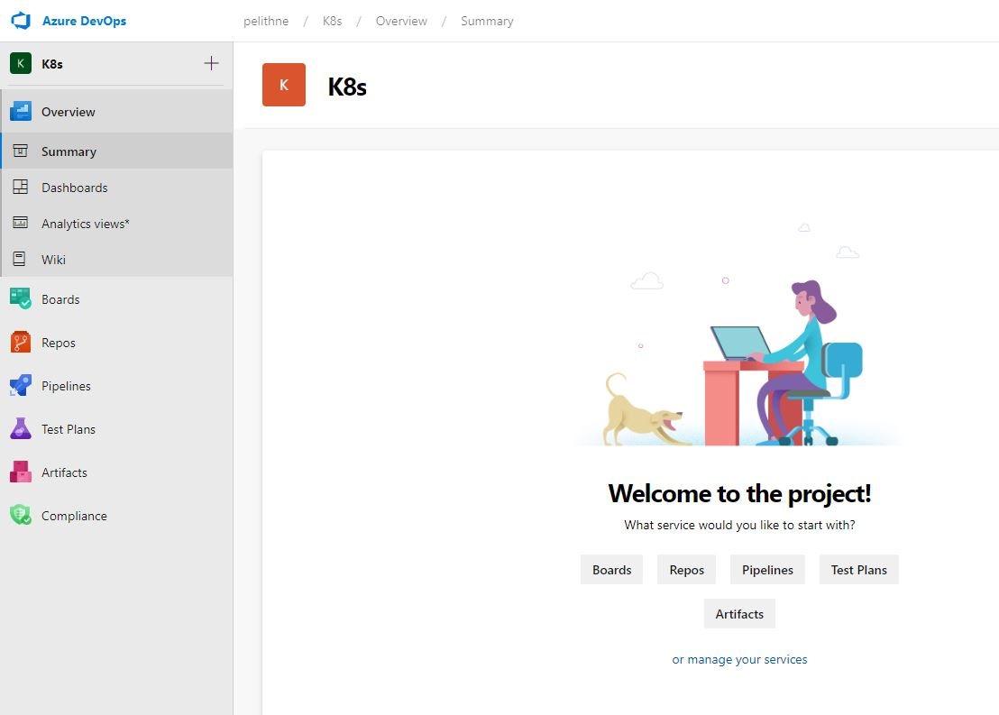
</p>


The left hand side shows you:

* **Overview** - overview of the Azure DevOps project like wiki, dashboards and more
* **Boards** - supporting a Agile work methodology with sprints and backlog
* **Repos** - your source code
* **Pipelines** - build and release - the essence of CI/CD
* **TestPlans** - testing overview
* **Artifacts** - your build artifacts that you might share in other projects, like nuget packages and such.

### 3.7.2. Create your Repository

During this step we will import the same repository we have been working with in previous steps, but this time we will import it into Azure Devops instead.

To do this, start by clicking on *Repos*.

Select "import a repository"
<p align="left">
  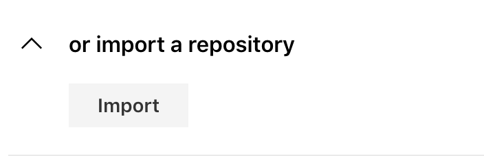
</p>

Then type in the URL to the repository (this is becoming familiar by now... :-) ): https://github.com/pelithne/k8s and click **Import**
<p align="left">
  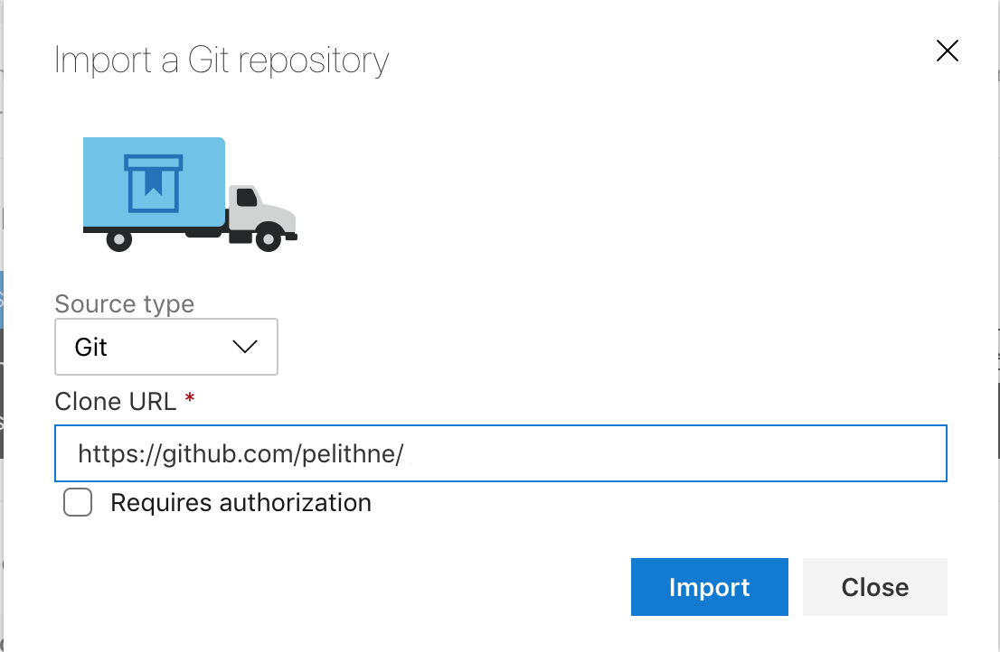
</p>

When the import is finished, you will have your own version of the repository in Azure Devops. The code that you will work with in this part of the tutorial are located in the ````application/azure-vote-app```` folder.

In order for for Azure Devops to use the container that you created in previous steps, you need to update the Kubernetes Manifest (once again!). Navigate to the manifest named ````azure-vote-all-in-one-redis.yaml```` in the application folder.

#### 3.7.2.1. Note: The repo you imported is the "original" repo, which does not have any of the changes you made before, so you start from "scratch".

You can edit the file in your browser by selecting **edit** in the top toolbar. Scroll down in the file, and change 

````bash
image: microsoft/azure-vote-front:v1
````

to

````bash
image: <your unique ACR name>.azurecr.io/azure-vote-front:v1
````

Don't forget to select "Commit" after the change, to include the change in your repository.

### 3.7.3. Connect Azure and Azure DevOps

Make sure you are using the same account in both Azure and Azure DevOps (same email addess).

In Azure DevOps, you need to create two service connections from Azure DevOps to Azure:

1. Docker Service Registry Connection
2. Azure Kubernetes Service

The docker service connections enables Azure Devops to  perform operations on your docker registry. In this case, the Docker Registry is the Azure Container Registry you created in a previous step.

The AKS service connection enables Azure devops to perform operations on your Kubernetes cluster.

To create the service connections, click on **Project Settings** at the bottom of the left hand navigation panel. Then go to **Service Connections**. 

Select "New service connection" and write "Docker Registry" in the search field. Make sure ````Docker Registry```` is selected and press ````next````.  Now, choose Azure Container Registry as ````registry type```` and select the ACR that you created earlier in the workshop. Finally give the connection a nice name and click *Save*.  

<p align="left">
  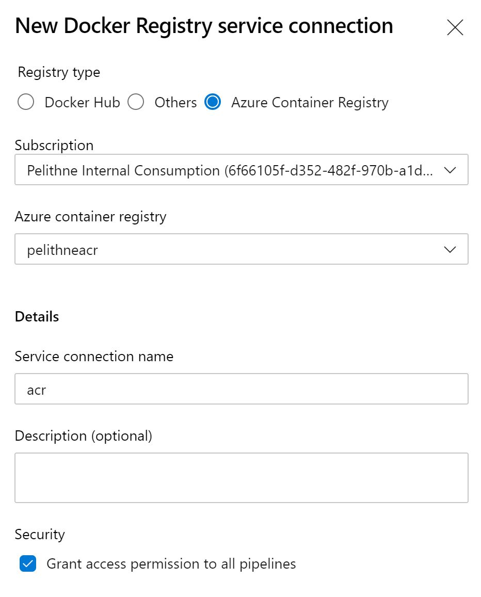
</p>

Create a second servcie connection for the AKS cluster using the same method. Hint: write "Kubernetes" in the search field to find the ````kubernetes```` connection type.

Make sure to select the right subscription, and the right Kubernetes Cluster.

<p align="left">
  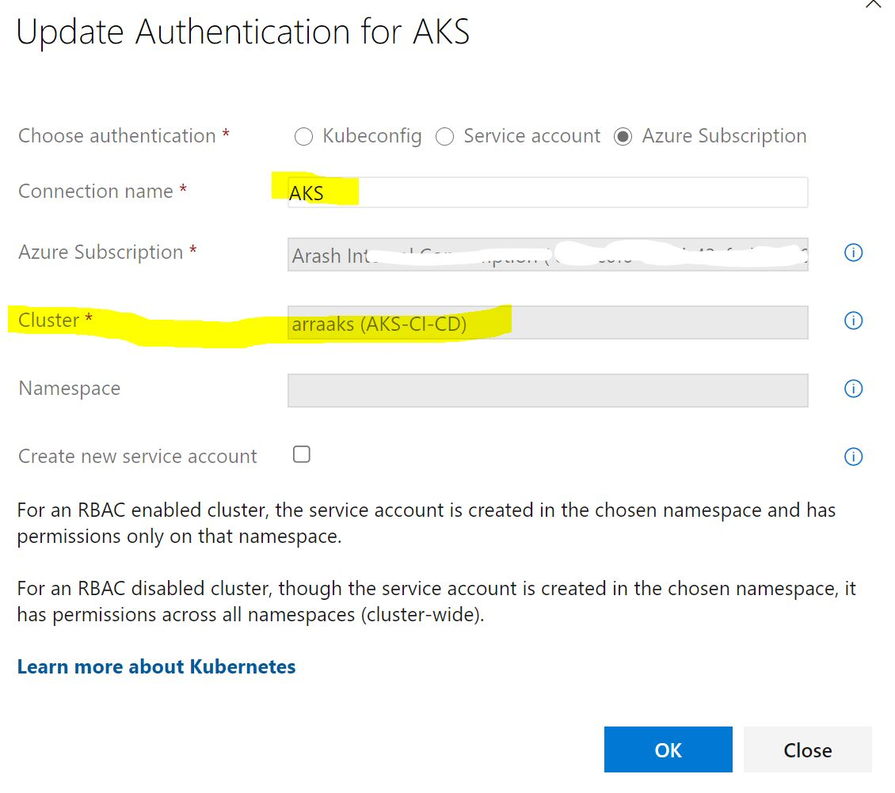
</p>

### 3.7.4. Create Build and Release Pipelines

We are going to:

* Create a build pipeline
* Create a release pipeline that is chained to the build pipeline

We will define the pipeline as **code**, in your repository. The feature is currently in preview and in order to use it you need to enable multistage pipelines, read this: <https://devblogs.microsoft.com/devops/whats-new-with-azure-pipelines>

To enable this preview feature click on your account icon in the top right corner, and select the three dots down to the left, then click on *User settings*.

<p align="left">
  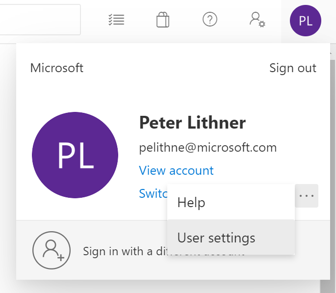
</p>

In the dialogue that follows, select *Preview features* and make sure that the *Multi-stage pipeline* toggle is set to **On**.

<!---
<p align="left">
  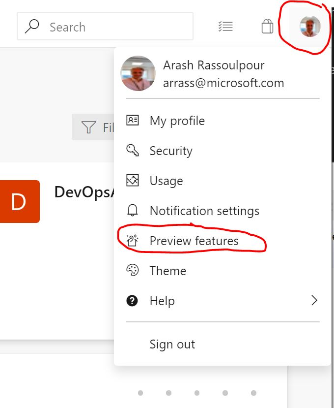
</p>

Enable "Multi-stage pipelines":

-->

<p align="left">
  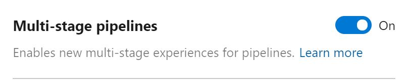
</p>

Creating a new Pipeline:

Go to Pipelines and create a new pipeline:

<p align="left">
  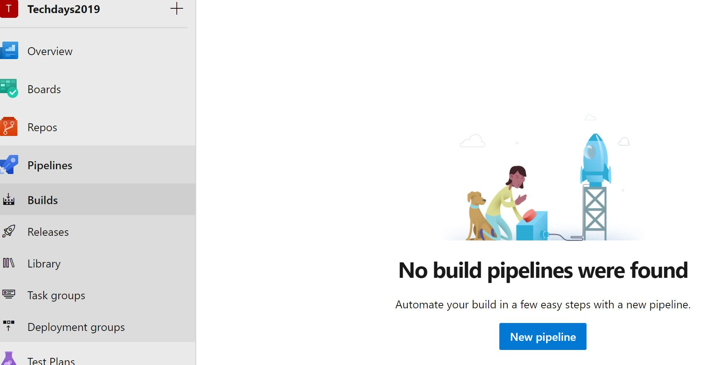
</p>

Choose "Azure Repos Git" and then select the repository that you previously imported to Azure DevOps.

<p align="left">
  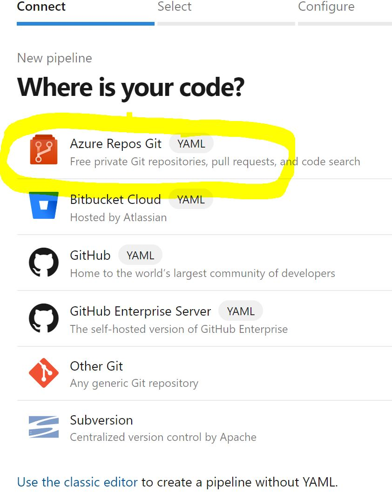
</p>

First select the repository (e.g. "k8s") then choose "Existing Azure Pipelines YAML file", and then select the path ````/application/azure-pipelines.yml```` and press **Continue**

<p align="left">
  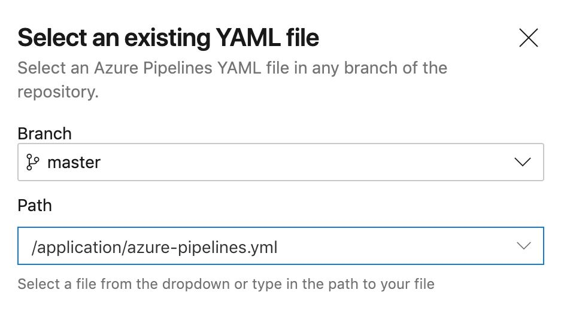
</p>

The azure-pipelines.yaml should look like this:

```yaml

trigger:
- master

pool:
  vmImage: 'Ubuntu-16.04'

stages:

- stage: A_stage
  jobs:
   - job: A_job
     steps:
      - bash: echo "A"

- stage: B_stage
  jobs:
   - job: B_job
     steps:
      - bash: echo "B"

```

Run the pipeline and see the steps in the build. If you click on the steps, you can drill down into the step to get some more details about what is going on. 

It should look similar to this:
<p align="left">
  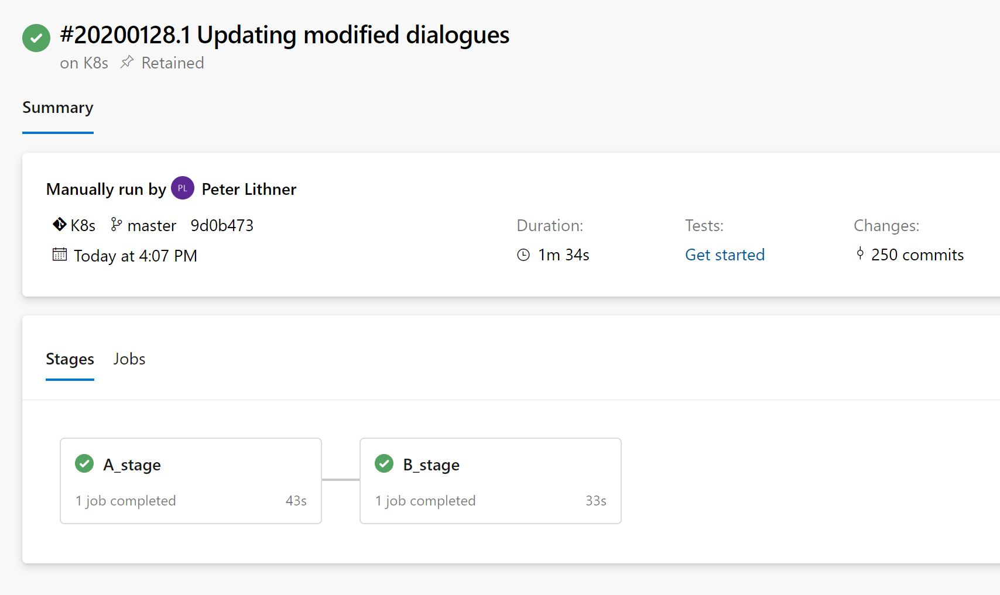
</p>

### 3.7.5. Create Pipeline

As mentioned before, we call this a **Multistage pipeline**, which is defined as code. If you want to know more about multistage pipelines, have a look here: https://docs.microsoft.com/en-us/azure/devops/pipelines/process/stages?view=azure-devops&tabs=yaml). 

In the pipeline, we have Build and Release stages that are chained together. The example YAML in the repository tries to explain the relationships between the different actions and keywords.

* trigger: Means that the pipeline will automatically trigger on check in to the master branch

* pool: the vm type the build will be conducted on

* stage: Could be "Build" or "Release" or anything that makes sense 

* jobs: group of several "job"-sections

* job: group of "steps" to achieve the job

* steps: atomic actions

Open the pipeline again and edit it.

Lets start implementing the "Development stage". Rename the stage to "Build_Development". We will use the docker module in Azure Devops to help us creating the build step.

On the right hand search for "Docker" and fill in the details. Make sure your cursor is positioned after "steps" then press "Add".

<p align="left">
  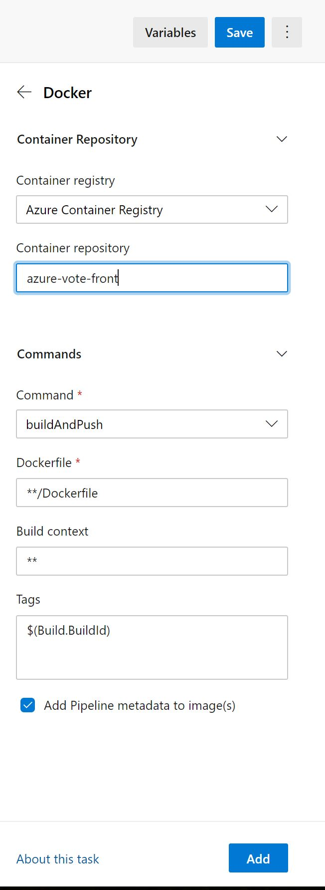
</p>

When choosing add, Azure Devops will add a **task** in the azure-pipelines.yaml. In the yaml file you fill find the following:

* task: the actual build task, in this case Docker build, more information about the task can be found: <https://docs.microsoft.com/en-us/azure/devops/pipelines/tasks/build/docker?view=azure-devops>

* containerRegistry: your Azure Container Registry Service Connection

* repository: the repository inside Azure Container Registry to store your Docker image

* command: both build and push the image

* Dockerfile: the path and name to the Dockerfile. '**' will start searching in the directory specified

* tags: the Docker build tag to be appended. $(Build.BuildId) is a predefined environment variable in Azure DevOps that is incremented at every build, more information about Azure DevOps built in environment variables can be found here: <https://docs.microsoft.com/en-us/azure/devops/pipelines/build/variables?view=azure-devops&tabs=yaml>


Make sure you add the "tags: $(Build.BuildId)" otherwise the build will not update the tag of the image. Also, the tags: $(Build.BuildId) is unique for this build and in the release stage, we need to refer to this tag in order for the right image to be deployed.

The final yaml file should look similar to this:

```yaml
trigger:
- master

pool:
  vmImage: 'Ubuntu-16.04'


stages:
- stage: 'Build_Development'
  jobs:
  - job:
    steps:
    - task: Docker@2
      inputs:
        containerRegistry: 'Azure Container Registry'
        repository: 'azure-vote-front'
        command: 'buildAndPush'
        Dockerfile: '**/Dockerfile'
        tags: $(Build.BuildId)

- stage: B_stage
  jobs:
   - job: B_job
     steps:
      - bash: echo "B"
```

Save and run the pipeline. Make sure it builds successfully.

<p align="left">
  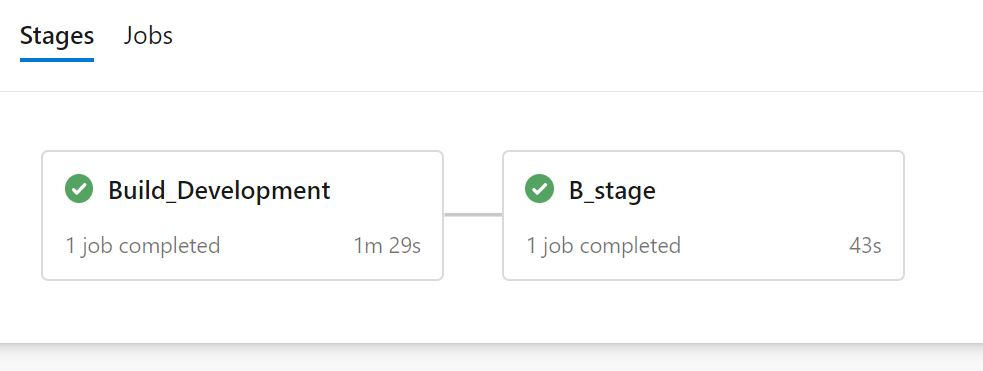
</p>

Notice the change of the first stage and also make sure the build was ok by looking into the details of the stage.

After doing the build, we have our image and build tag set. The only thing we need to do now is to deploy the application to AKS. Do this by adding a release stage to the pipeline yaml. Make sure to use the specific image name and especially the tag just like we did manually earlier.

Open the pipeline and edit the stage B to include the release. This stage will update our Kubernetes manifest, and deploy the application to AKS. To achieve this search for "Manifest" (like you did previously with the docker task) and add it.

#### 3.7.5.1. Note: the path to the kubernetes manifest should be ````application/azure-vote-app/azure-vote-all-in-one-redis.yaml````

<p align="left">
  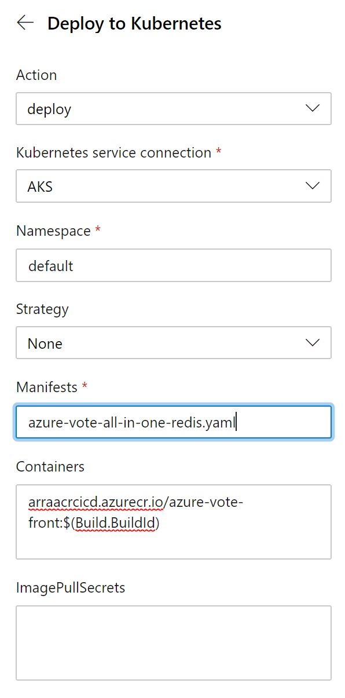
</p>

Make sure the alignment of the task comes under "steps". 

Also we are adding a condition: succeeded('Build_Development') which indicates that the stage is **only** run if the "Build_Development" stage was successful. You can read more about the conditions here: https://docs.microsoft.com/en-us/azure/devops/pipelines/process/stages?view=azure-devops&tabs=yaml#conditions

**Also note the "containers" part** which will update the actual image and tag and append the **$(Build.BuildId)** to the end of the image tag to be deployed.

The Kubernetes manifest task is described here in more detail: https://docs.microsoft.com/en-us/azure/devops/pipelines/tasks/deploy/kubernetes-manifest?view=azure-devops

The final pipeline should look similar to this:

```yaml
trigger:
- master

pool:
  vmImage: 'Ubuntu-16.04'


stages:
- stage: 'Build_Development'
  jobs:
  - job:
    steps:
    - task: Docker@2
      inputs:
        containerRegistry: 'Azure Container Registry'
        repository: k8s/azure-vote-front
        command: 'buildAndPush'
        Dockerfile: '**/Dockerfile'
        tags: $(Build.BuildId)

# stage 'Release to Development' runs if 'Build Development' succeeds
- stage: 'Release_to_Development'
  condition: succeeded('Build_Development')
  jobs:
  - job:
    steps:
    - task: KubernetesManifest@0
      inputs:
        action: 'deploy'
        kubernetesServiceConnection: 'AKS'
        namespace: 'default'
        manifests: 'application/azure-vote-app/azure-vote-all-in-one-redis.yaml'
        containers: 'arraacrcicd.azurecr.io/azure-vote-front:$(Build.BuildId)'
```

Make sure the pipeline is building and releasing successfully. Please note that you may have to give permission to use the service connections:

<p align="left">
  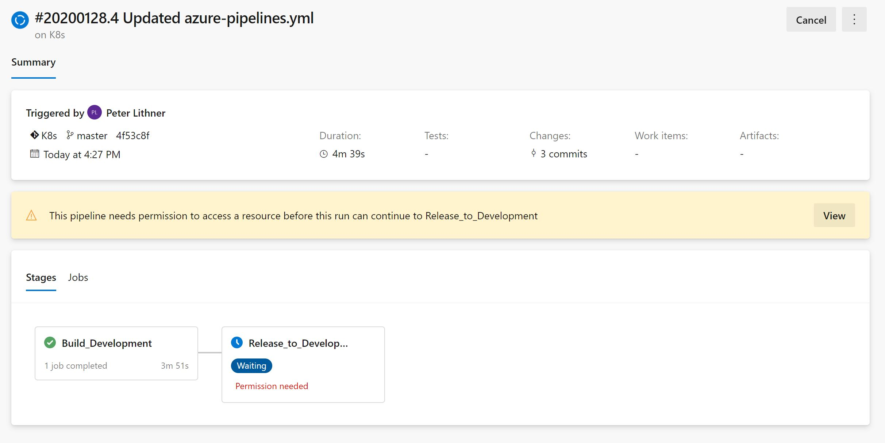
</p>

 Also make sure the Azure Container Registry is updated with a new tag and check the status of the AKS cluster in Azure Cloud Shell.

To make sure the application is running, you need to find the public IP address of the LoadBalancer. Use ````kubectl get svc```` in Azure Cloud shell:

````bash
kubectl get svc
````

Which should give output similar to

````bash
NAME               TYPE           CLUSTER-IP    EXTERNAL-IP     PORT(S)        AGE
azure-vote-back    ClusterIP      10.0.97.213   <none>          6379/TCP       6m1s
azure-vote-front   LoadBalancer   10.0.98.192   13.73.137.254   80:30824/TCP   6m1s
kubernetes         ClusterIP      10.0.0.1      <none>          443/TCP        4d6h
````

Copy the **Public IP address** of the azure-vote-front service into the address field of your browser to view the web interface of your application.

### 3.7.6. All-In-One

Let's change some code and watch the whole chain roll from Code commit ->Build->Release. 

Open the file: azure-vote-app/azure-vote/config_file.cfg (using the editor in Azure Devops) and change the code:

```py
# UI Configurations
TITLE = 'Azure Voting App'
VOTE1VALUE = 'Yellow'  <-- changed
VOTE2VALUE = 'Pink'    <-- changed
SHOWHOST = 'false'
```

Remember to commit the change when you are done.

Click **Pipelines** in the left hand navigation pane to watch the build automatically triggered in Azure DevOps and see how the Release stage starts when the build is done.

<p align="left">
  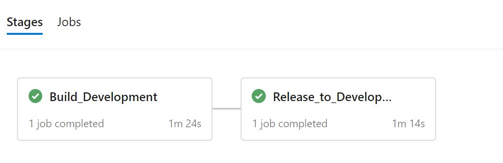
</p>

The public endpoint of the application should not change, but feel free to verify the IP address by using ````kubectl```` again:

```bash
>kubectl get services
NAME               TYPE           CLUSTER-IP     EXTERNAL-IP      PORT(S)        AGE
azure-vote-back    ClusterIP      10.0.208.112   <none>           6379/TCP      2d23h
azure-vote-front   LoadBalancer   10.0.243.181   13.73.137.254    80:31448/TCP  2d23h
kubernetes         ClusterIP      10.0.0.1       <none>           443/TCP       5d6h

```

Open the public IP-addess, and watch the Yellow and Pink buttons have changed.

<p align="left">
  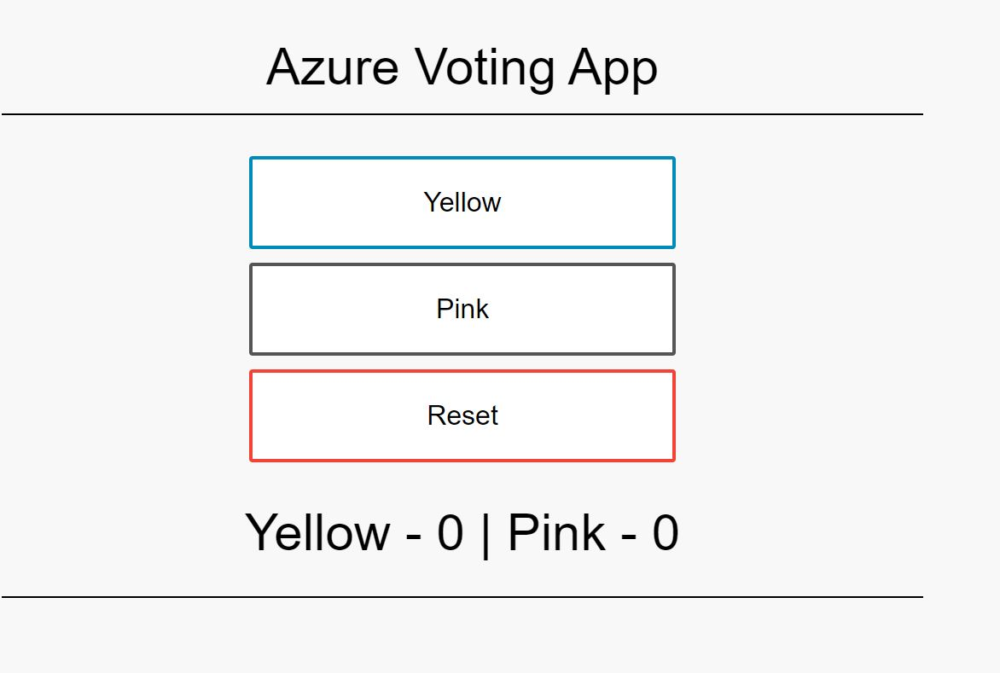
</p>

### 3.7.7. Scale applications in Azure Kubernetes Service (AKS)

In this step you will scale out the pods in the app and try basic pod level scaling.

You can use Azure DevOps to configure the number of pods in the cluster for one service. This is a very easy task since all of your infrastructure of Kubernetes resides within the "azure-vote-all-in-one-redis.yaml" file.

Open the "azure-vote-all-in-one-redis.yaml" file.

Change "replicas" from 1 to 4 and the commit the file. The commit will trigger an automatic build and deploy by running the DevOps pipeline you just defined earlier.

```yaml

apiVersion: apps/v1beta1
kind: Deployment
metadata:
  name: azure-vote-front
spec:
  replicas: 4

```

Once you have committed the file, open Azure DevOps and watch the automatic build been triggered.

Once the build is finished you can open **Azure Cloud Shell** now run ````kubectl```` and watch the number of pods. You should now have 4 "azure-vote-front-*" pods.

```bash

>kubectl get pods
NAME                                READY   STATUS    RESTARTS   AGE
azure-vote-back-5b84769c69-z4r7j    1/1     Running   0          2d16h
azure-vote-front-55fb564887-fgl5t   1/1     Running   0          2m15s
azure-vote-front-55fb564887-s7vgv   1/1     Running   0          2m15s
azure-vote-front-55fb564887-tvjxd   1/1     Running   0          2m15s
azure-vote-front-55fb564887-xwd9t   1/1     Running   0          2d16h
>

```

### 3.7.8. Final Clean up

The easiest way to clean up your environment, and avoid unnecessary cost, is to remove the entire *Resource Group*.

To do this, go back to Azure Cloud Shell.

Assuming that the Resource Group name is k8s-rg, type the following command:

````azurecli
az group delete -n k8s-rg
````
